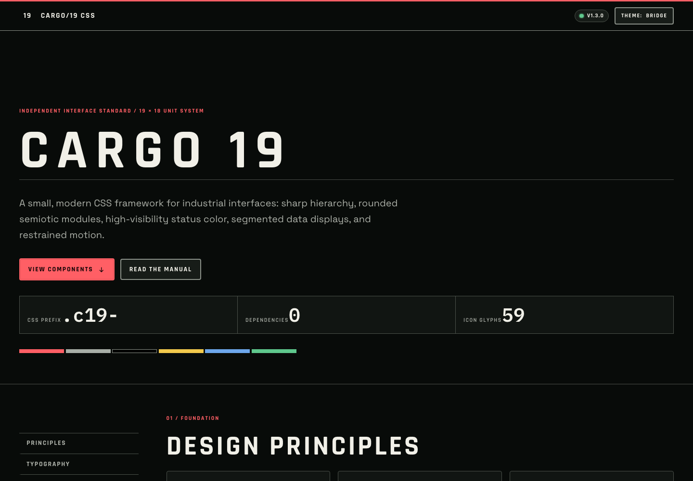

# CARGO/19 CSS



CARGO/19 is a small, dependency-free CSS framework for operational, retro-future interfaces. Version 1.3 consolidates the original 1.0 visual direction with the generated semiotic system, documentation, behaviors, and validation developed in 1.1 and 1.2.

The package is an independent design study. It is not an official product tied to any film or studio, and it contains no film stills, logos, proprietary production artwork, or font binaries.

## What is included

- layered source CSS and full, core, and minified distribution builds;
- paper, bridge, and automatic color themes;
- application navigation, panels, cards, controls, grouped forms, feedback, native popover menus, data display, overlays, terminals, and layout primitives;
- 59 original SVG glyphs: 39 framed equipment signs and 20 interface icons;
- a generated sprite, individual light and dark SVG files, and a JSON catalog;
- optional dependency-free JavaScript for tabs, dialogs, dismiss actions, copy controls, theme persistence, mobile manual navigation, and icon filtering;
- a responsive, self-hosted manual and two complete examples built exclusively with the framework.

## Quick start

```html
<link rel="stylesheet" href="dist/cargo19.css">
<script src="dist/cargo19.js" defer></script>

<body class="c19-root" data-c19-theme="bridge">
  <button class="c19-button" type="button">Begin cycle</button>
</body>
```

`dist/cargo19.css` imports the default web-font stack. Use `dist/cargo19-core.css` for the same framework with no external font request.

Serve the project directory over HTTP to browse the manual and external SVG sprite reliably:

```bash
npx --yes serve . --listen 8000
```

Then open `/index.html` in the local server.

## Distribution builds

| File | Purpose |
|---|---|
| `dist/cargo19.css` | Readable full build with the Google Fonts import. |
| `dist/cargo19-core.css` | Readable, font-request-free build with system fallbacks. |
| `dist/cargo19.min.css` | Minified full build. |
| `dist/cargo19.js` | Optional behavior layer; no dependencies or globals. |

## Typography

The default roles are intentionally separate:

- **Space Grotesk** for body and interface copy;
- **Rajdhani** for display construction, compressed labels, controls, and panel identifiers;
- **IBM Plex Mono** for telemetry, code, tabular data, and terminals.

The online build references these open-source families rather than redistributing their binaries. The core build falls back to locally available sans-serif, condensed, and monospace families. See `FONT-SOURCES.md` for source and licensing details.

## Themes

Apply a theme to the root document or any component subtree:

```html
<html data-c19-theme="paper">
<html data-c19-theme="bridge">
<html data-c19-theme="auto">
```

Theme state changed through `[data-c19-theme-toggle]` is persisted by the optional JavaScript helper.

Use custom properties for local variation:

```css
.my-console {
  --c19-signal-red: #d4002a;
  --c19-radius-md: 0.25rem;
  --c19-content: 90rem;
}
```

Component families also expose focused variables such as `--c19-panel-bg`, `--c19-button-radius`, `--c19-control-border`, and `--c19-menu-shadow`. They inherit through application regions and fall back to the global tokens above.

The fixed equipment-sign palette is separate from the accessible interface-status palette. That distinction lets the signs retain their construction standard while controls and text meet contemporary contrast requirements.

## Icons

All icons share `viewBox="0 0 19 18"`. Framed equipment signs use one red outer field, one pale equipment plate, a white separation outline, and a controlled seven-color palette. Interface glyphs use the same frame with a consistent stroke grammar.

Use the external sprite:

```html
<svg class="c19-icon" aria-hidden="true">
  <use href="icons/cargo19-icons.svg#c19-airlock"></use>
</svg>
```

Use the sign at a standardized size:

```html
<span class="c19-symbol c19-symbol-md">
  <svg class="c19-icon" role="img" aria-label="Airlock">
    <use href="icons/cargo19-icons.svg#c19-airlock"></use>
  </svg>
</span>
```

For interface controls, put the accessible name on the control rather than the decorative SVG:

```html
<button class="c19-icon-button c19-icon-button--ghost" aria-label="Open menu">
  <svg class="c19-icon" aria-hidden="true">
    <use href="icons/cargo19-icons.svg#c19-menu"></use>
  </svg>
</button>
```

The complete machine-readable catalog is in `icons/catalog.json`. Individual exports are in `icons/individual/` and `icons/individual-dark/`.

External sprite fragments are intended for pages served over HTTP. For direct `file://` browsing—particularly in Safari—embed `cargo19-icons.svg` once in the document and use same-document references such as `href="#c19-airlock"`. The generated System Manual and examples already use this mode.

## Components

The component layer includes:

- application bars, brands, numbered navigation, panels, cards, and sign containers;
- buttons, icon buttons, inputs, input groups, textareas, selects, choices, and switches;
- badges, status indicators, alerts, toasts, tooltips, skeletons, inline loading, native popover menus, and native dialogs;
- tabs, accordions, pagination, command bars, tables, progress bars, segmented meters, statistics, and terminal surfaces;
- stack, cluster, grid, auto-grid, container, split, sidebar, sticky, and responsive documentation-shell primitives.

See `COMPONENTS.md` for public classes, data attributes, and behavior notes. The live specimens in `docs/components.html` are framework markup, not screenshots.

## JavaScript helper

JavaScript is optional. `dist/cargo19.js` enables:

- ARIA tab activation and arrow-key navigation;
- native dialog open and close controls;
- dismissible messages;
- paper/bridge theme toggling with persisted state;
- the responsive manual navigation;
- copy buttons for documentation code blocks;
- live icon-catalog filtering and result counts.

It does not create global variables and leaves layout and baseline semantics in HTML and CSS.

## Build and validation

The release pipeline uses the Ruby standard library plus optional local validators when available:

```bash
ruby tools/release.rb
```

That command regenerates icons, CSS, JavaScript, documentation, metadata checksums, and then runs structural validation.

Individual commands:

```bash
ruby tools/build_icons.rb
ruby tools/build.rb
ruby tools/build_docs.rb
ruby tools/validate.rb
```

Validation checks include icon counts and viewBoxes, duplicate SVG and HTML IDs, local asset links, generated-page theme usage, prohibition of page-local style blocks, font-binary exclusion, CSS delimiter balance, JavaScript syntax when Node.js is available, and checksum freshness.

## Accessibility

- visible keyboard focus indicators are built in;
- the tab helper follows the ARIA tab interaction pattern;
- status patterns pair color with text or symbols;
- motion is reduced under `prefers-reduced-motion`;
- form controls retain native semantics;
- icon-only controls require an accessible name;
- documentation includes a skip link and responsive navigation state;
- decorative SVGs use `aria-hidden`, while meaningful standalone signs can use `role="img"` and an accessible label.

## Browser target

The framework targets current evergreen browsers. It uses cascade layers, custom properties, `color-mix()`, container-aware type sizing, `backdrop-filter`, and native `<dialog>`. Core content remains readable where a decorative enhancement is unsupported.

## Project structure

```text
cargo19-css-1.3.0/
├── dist/                     compiled CSS and optional JavaScript
├── src/                      layered source files
├── icons/                    sprite, 118 standalone exports, and catalog
├── docs/                     themed, responsive system manual
├── examples/                 bridge dashboard and operations form
├── tools/                    icon, CSS, docs, release, and validation scripts
├── index.html                documentation entry page
├── COMPONENTS.md             public class and behavior index
├── FONT-SOURCES.md           font sources and licensing routes
├── DIST-SHA256.txt           generated distribution checksums
├── manifest.json             machine-readable package inventory
├── NOTICE.md                 attribution and design boundaries
├── CHANGELOG.md              release history
└── LICENSE                   MIT license
```

## License

Framework code and original icon drawings are licensed under MIT. External font software is not bundled and remains subject to its own license.
